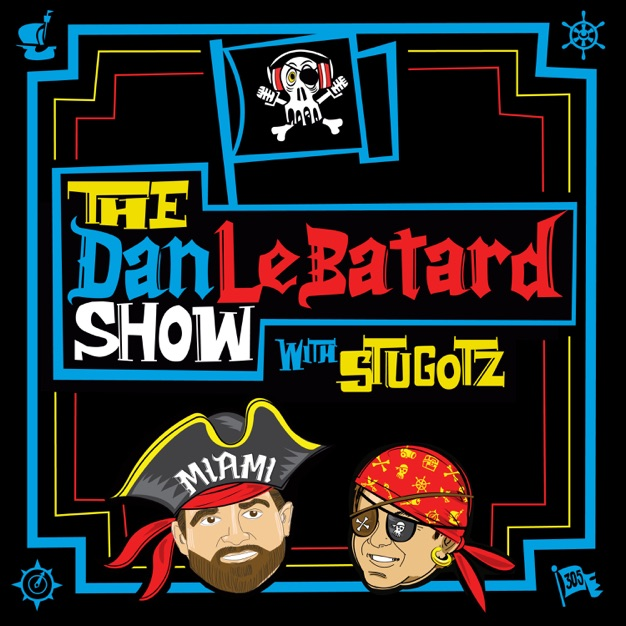

# **Dan Le Batard Bucket of Death Helper Tool Project**

The key words "MUST", "MUST NOT", "REQUIRED", "SHALL", "SHALL NOT", "SHOULD", "SHOULD NOT", RECOMMENDED", "MAY", and "OPTIONAL" in this docuent are to be interpreted as 
described in [RFC 2119](https://datatracker.ietf.org/doc/html/rfc2119)

# Disclaimer
This is just a small project that is meant to be something from a regular listener of the Dan Le Batard Show with Stugotz Podcast. 
Any and all assets used here in this README are trademarks of Dan Le Batard, Meadowlark Media. These assets MUST be used only on this README file and MUST be taken down immediately
upon request of the copyright owners.

# About this project
This is a small helper tool from a guy who does not claim to get the show. However, upon years of listening to the bickering, fighting, cajoling, swindling, grifting, and, overall
Stugotz'ing of the Bucket of Death, the writer of this project decided to take matters into his own hands. The project is meant to be a 'helper' that does the following things:

* The end of as many shenanigans as possible
  * The bucket cannot be cheated because the bucket is digitized. No more hidden Golden Helmets of Life (GHoL), no more rummaging (though the author intends to make that an option later), 
  no more complaining and moaning and wailing and gnashing of teeth. While half the fun of the segment is the physical interaction with the bucket, the project hopes to make a trade-off
  by automating the process and allowing UX/UI to help enhance the fun and add all the shiny colors and whistles that would even keep the attention of SueGotz.
* Commissioner Billy becomes a figurehead, like Elizabeth II
  * The author admits and fully fledges his confession that one Guillermo is his least favorite member of the pirate ship and, should he ever have the power to make him more useless
  than the sound of an NFL coach, will attempt to do so. From a technical perspective of the project, this means that, by automating things, errors are less likely to occur, and 
  the segment can be more streamlined, hopefully helping production by making less moving parts.

**Under Construction**
